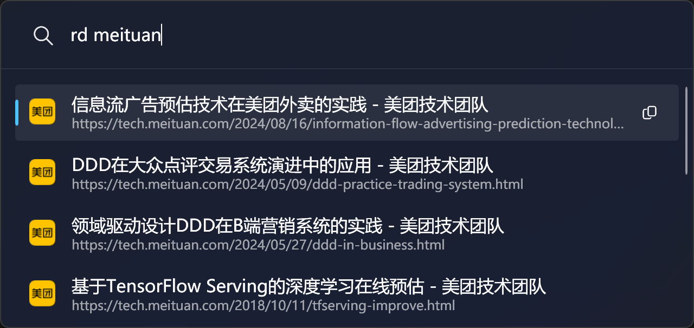

# Raindrop.io plugin for PowerToys Run

Access your Raindrop.io bookmarks with PowerToys Run

## Prerequisites

1. PowerToys v0.86 or higher.

## Installation

1. Download the plugin from the Releases page.
2. Exit PowerToys completely.
3. Extract the ZIP file to `%LOCALAPPDATA%\Microsoft\PowerToys\PowerToys Run\Plugins`.
4. Reopen PowerToys.
5. Configure the plugin.
6. Restart PowerToys.

## Note

To obtain your Raindrop access token, please follow these steps:

1. In the `For Developers` section, click on `Create new app`.
2. Set the app name, and check `I accept the Raindrop.io API Terms & Guidelines`.
3. In the newly created app, click on `Create test token`.
4. Copy the created token.
